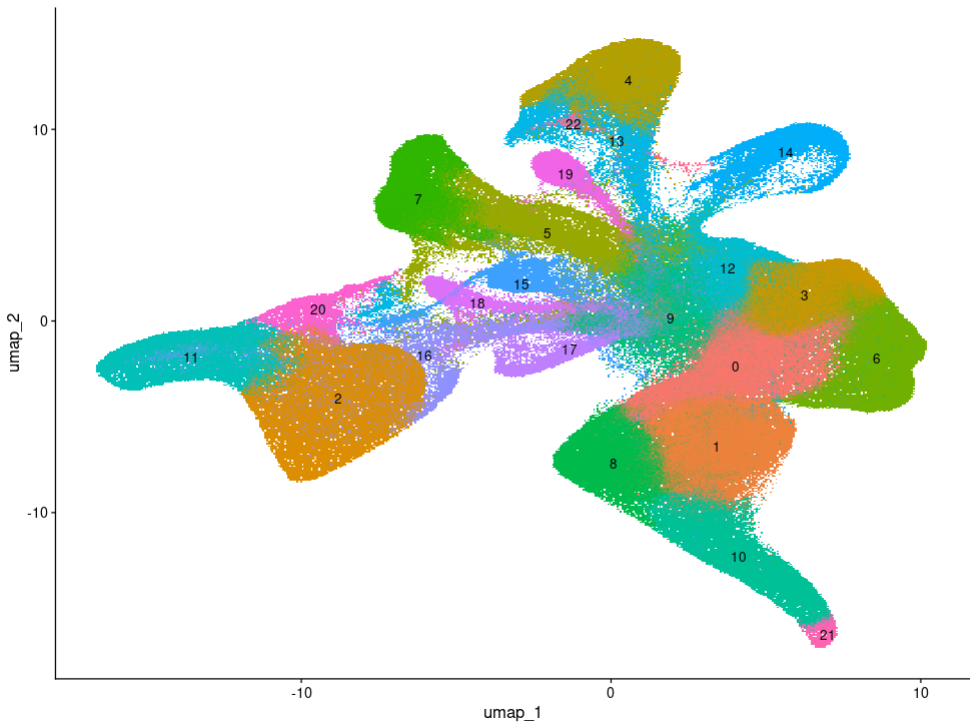
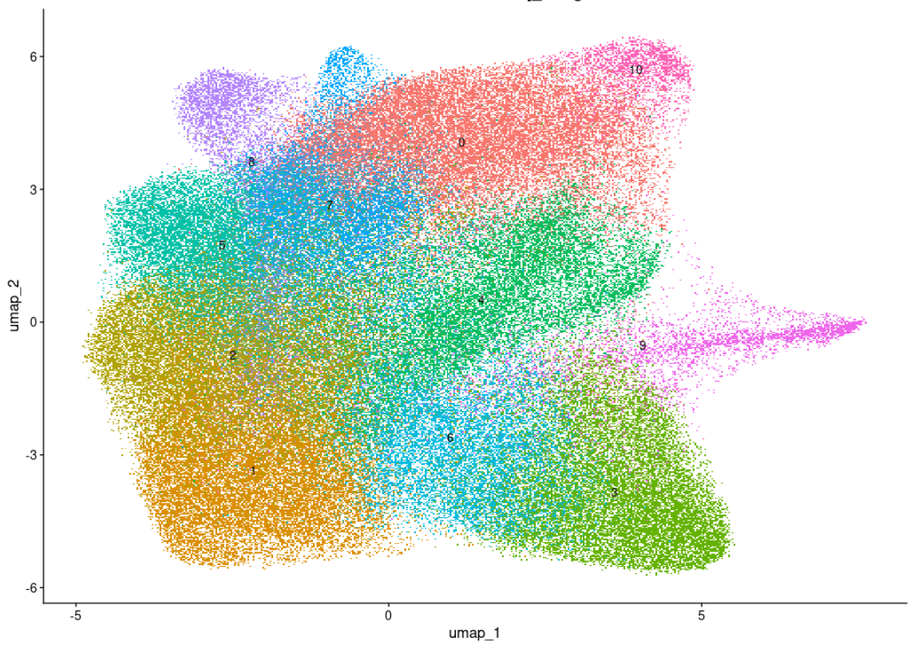

# 🧬 Cross-tumor myeloid landscape from CancerSCEM data

This repository documents a pipeline to explore the **myeloid compartment across multiple human tumors** using single-cell RNA-seq data from [CancerSCEM](https://ngdc.cncb.ac.cn/cancerscem/downloads). The goal is to obtain a unified view of myeloid diversity across cancer types and study transcriptional programs within this lineage.

---

## 🔄 Workflow overview

### 1. Data acquisition

Public scRNA-seq count matrices were downloaded for the following tumor types:

- GBM, BRCA, SKCM, LUAD, NSCLC, HCC, KIRC, OV

Each dataset was processed independently using `Seurat`.

---

### 2. Per-tumor preprocessing and clustering

For each tumor:

- Expression matrices were loaded and converted to `Seurat` objects
- Basic preprocessing was applied: normalization, feature selection, scaling, PCA
- Datasets were merged and integrated using **`IntegrateLayers(method = CCAIntegration)`**
- Clusters were identified and visualized via UMAP
- **Marker genes** were extracted per cluster to annotate major cell types

> 💡 *Example: UMAP of LUAD dataset after integration and clustering.*

  

---

### 3. Myeloid extraction and integration

Clusters corresponding to **myeloid populations** were manually identified based on marker genes. For each tumor, a subsetted `Seurat` object was saved containing only myeloid cells.

These myeloid subsets were then re-loaded and **integrated across tumors** using `IntegrateLayers()` to generate a cross-tumor reference object for downstream analysis.

  

---

### 4. Downstream analysis

The final integrated myeloid object was used to:

- Identify transcriptional clusters within the myeloid lineage
- Explore the distribution of **transcriptional signatures** across conditions or tumor types
- Serve as a reference for future comparisons

---

## 📁 Project structure

